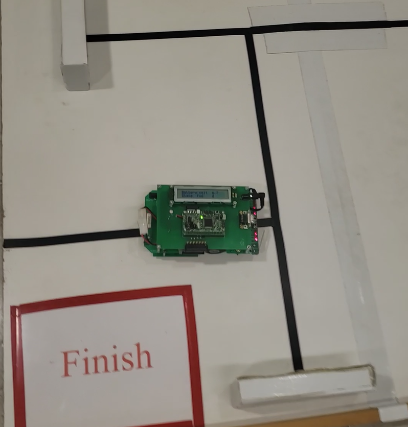
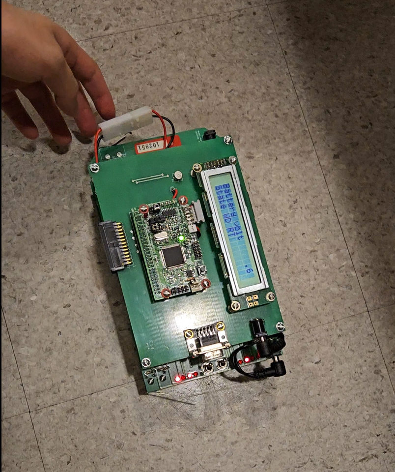

# EEbot Maze Runner 🚀🤖

## Objective  
This project aims to develop a program that enables the **EEbot mobile robot** to navigate a maze using its **sensors** and **front bumper**.  

The EEbot is equipped with 6 sensors:  
- **A**: Front Sensor  
- **B**: Port Sensor  
- **C**: Middle Sensor  
- **D**: Starboard Sensor  
- **E, F**: Line Sensors  

The robot uses these sensors, along with bumper inputs, to determine its path through **trial-and-error navigation**. By continuously processing sensor data, the EEbot can detect obstacles, follow maze lines, and adjust its alignment.

---

## System Description 🛠️

### 1. Dispatcher  
Implements a **Finite State Machine (FSM)** stored in register **A**. Each state corresponds to a subroutine that directs the EEbot’s movements and reactions when conditions are met.

### 2. Movements  
Contains the **movement and action subroutines**:  
- Forward & reverse motion  
- Left & right turns  
- Realignment to maze lines  

These routines are called by the dispatcher when triggered.

### 3. Timer Overflow  
A background **timer system** ensures proper timing of actions without halting the program:  
- Uses a counter with overflow detection  
- Employs a **Prescaler** for longer delays  
- Compares current clock counter with a delay value for smooth timing  

### 4. Sensors  
Handles analog-to-digital conversion (ADC) and stores readings for decision-making:  
- `READ_SENSORS`: Initializes sensors for reading  
- `SELECT_SENSOR`: Selects the active sensor  
- ADC module converts analog signals to 8-bit digital values  
- Data stored in arrays for future processing  

---

## Issues Encountered ⚠️

### 1. Line Readers Not Fully Functional  
- Initial bug: `READ_SENSORS` subroutine exited too early.  
- Fix: Extended the loop to read all sensors, improving path alignment.  

### 2. Missed Intersection Detection  
- Forward state logic did not check for intersections.  
- Fix: Added sensor-based intersection detection to transition into `LEFT_TRN` or `RIGHT_TRN`.  

### 3. Back Bumper Failure After Turn Implementation  
- Reverse logic (`INIT_REV`) unintentionally disabled back bumper checks.  
- Issue deprioritized in favor of turn logic, but future updates will restore functionality.  

### 4. Inconsistent Maze Completion  
- Possible causes: hardware fatigue, sensor calibration, or environmental variations.  
- Highlighted need for **robust error handling** and **periodic hardware checks**.  

---

## Insights & Lessons Learned 📚  

Managing this project provided valuable experience in **software development and robotics integration**.  

- ✅ FSM design simplified debugging and state control.  
- ✅ Hardware abstraction made updates manageable.  
- ✅ Team problem-solving was key to resolving sensor issues.  
- ⚠️ Integration testing delays compounded problems (e.g., bumper + turning logic conflicts).  
- ⚠️ Sensor calibration challenges caused inconsistencies.  

### Improvements for Future Projects:
- Modular testing of individual subsystems.  
- Iterative development with clear milestones.  
- Automated tests for sensor logic and state transitions.  
- Better calibration methods for consistent performance.  
- Error-handling states for improved reliability.  

---

## Media 📸  

### EEbot in Action  
  

### Sensor Debugging Process  
  

---

## Author: Sayeed Ahmed✍️  
Developed as part of an **Embedded Systems course project**.  
Insights gained will guide future **robotics and control system development**.  
